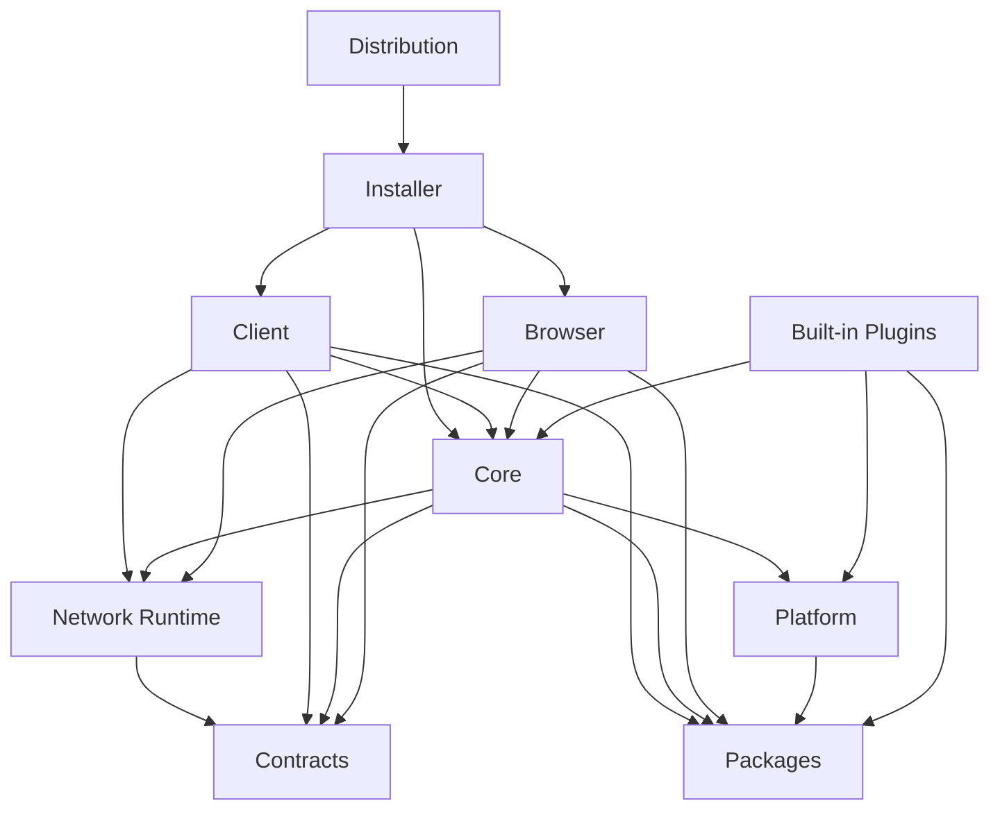

# Code Map

상태: `CURRENT`

이 문서는 사람이 읽는 공필 구성 지도다. 기계 판독 정본은 `component-registry.json`이며 두 파일은 함께 갱신한다.

## 현재 작업 위치

| 항목 | 값 |
|---|---|
| 작업 단위 | `network-runtime-loopback-slice` |
| 상태 | `COMPLETED` |
| 완료일 | `2026-07-27` |
| 다음 권장 작업 | `client-core-loopback-bootstrap-slice` |
| 브랜치 | `codex/bootstrap-structure` |
| 활성 컴포넌트 | `gongpil.repository`, `gongpil.network-runtime`, `gongpil.tests`, `gongpil.architecture`, `gongpil.code-map-tooling` |
| 활성 기능 | `network.runtime.facade`, `network.status.observe`, `network.host.loopback-http`, `network.transport.loopback-http`, `network.event.sse`, `network.demo.loopback` |
| 목적 | 실제 loopback HTTP·SSE와 후보 교체 롤백 수직 슬라이스 완성 |

## 상태 라벨

| 상태 | 의미 |
|---|---|
| `CURRENT` | 파일과 검증 근거가 현재 존재함 |
| `TARGET` | 목표가 정해졌으나 구현되지 않음 |
| `TBD` | 구현 전 결정 필요 |

## 컴포넌트 관계



## 기능 위치

| 기능 | 소유 컴포넌트 | 현재 경로 | 상태 |
|---|---|---|---|
| 기능·작업 위치 추적 | Architecture | `docs/architecture/component-registry.json` | `CURRENT` |
| Code Map 검증 | Code Map Tooling | `scripts/validate-code-map.ps1` | `CURRENT` |
| 실행 기준 경로 결정 | Client | `client/` | `TARGET` |
| Core 프로세스 수명 관리 | Client | `client/` | `TARGET` |
| Core 버전 선택·활성화·롤백 | Client | `client/` | `TARGET` |
| Client-Core 부트스트랩 계약 | Contracts | `packages/contracts/bootstrap/bootstrap-contracts.schema.json` | `CURRENT` |
| Browser 공개 세션 계약 | Contracts | `packages/contracts/bootstrap/bootstrap-contracts.schema.json` | `CURRENT` |
| 부트스트랩 계약 검증 | Code Map Tooling | `scripts/validate-bootstrap-contract.ps1` | `CURRENT` |
| NetworkRuntime v1 계약 | Contracts | `packages/contracts/network/network-contracts.schema.json` | `CURRENT` |
| 단일 송수신·접속 교체점 | Network Runtime | `platform/network-runtime/src/network-runtime.ts` | `CURRENT` |
| 네트워크 상태 집계·공개 | Network Runtime | `platform/network-runtime/src/network-status-machine.ts` | `CURRENT` |
| In-memory transport | Network Runtime | `platform/network-runtime/src/transports/in-memory-transport.ts` | `CURRENT` |
| 사용자 확인 CLI | Network Runtime | `platform/network-runtime/demo/network-runtime-demo.ts` | `CURRENT` |
| 127.0.0.1 동적 포트 HTTP host | Network Runtime | `platform/network-runtime/src/host/loopback-http-host.ts` | `CURRENT` |
| HTTP JSON loopback consumer | Network Runtime | `platform/network-runtime/src/transports/loopback-http-transport.ts` | `CURRENT` |
| 세션당 단일 SSE와 재접속 | Network Runtime | `platform/network-runtime/src/transports/loopback-http-transport.ts` | `CURRENT` |
| 실제 loopback 사용자 확인 CLI | Network Runtime | `platform/network-runtime/demo/loopback-network-runtime-demo.ts` | `CURRENT` |
| Node TypeScript 실행 진입점 | Repository | `package.json` | `CURRENT` |
| 네트워크 사용 위치 검증 | Code Map Tooling | `scripts/validate-network-map.ps1` | `CURRENT` |
| 문서 snapshot과 revision | Core | `core/` | `TARGET` |
| 변경 제안 승인과 적용 | Core | `core/` | `TARGET` |
| 공통 작업 UI | Browser | `browser/` | `TARGET` |
| 플러그인 격리 실행 | Platform | `platform/` | `TARGET` |
| Windows 설치 패키지 | Installer | `installer/` | `TARGET` |
| Markdown 편집기 | Built-in Plugins | `builtin-plugins/` | `TARGET` |

## Client와 Browser 경계

```text
Client
├─ appRoot
├─ dataRoot
├─ versionRoot
├─ sessionTemp
├─ bundledRuntimePath
└─ Core process lifecycle

Browser
├─ sessionId
├─ coreStatus
├─ activeProjectId
├─ activeProjectName
└─ readOnly
```

Browser는 Client의 실제 경로 값을 전달받지 않는다.

상세 계약과 Core 독립 업데이트 흐름은 `bootstrap-contract.md`에서 확인한다.

## 네트워크 단일 경계

```text
Feature
  └─ NetworkRuntime
       ├─ ReplaceConnection
       ├─ Send → NetworkCommandResult
       ├─ Subscribe ← NetworkEvent
       ├─ Cancel
       └─ GetStatus / SubscribeStatus
```

로컬은 loopback TCP 위의 HTTP JSON과 SSE, 클라우드는 같은 계약의 HTTPS를 사용한다. 기능별 네트워크 사용 위치는 `network-map.md`와 registry의 `networkUsage`에서 확인한다.

facade와 상태 집계, in-memory transport, 실제 loopback HTTP JSON host·consumer와 세션당 단일 SSE 재접속이 실행 가능하다. `npm run demo:network:loopback`으로 동적 포트, 송수신, 재접속과 후보 실패 롤백을 확인한다.

## 상시 갱신 순서

1. 작업 전 `workTracking`에 작업 단위, 브랜치, 활성 컴포넌트와 기능을 기록한다.
2. 새 작업을 시작할 때 `workTracking.status`를 `IN_PROGRESS`로 바꾼다.
3. 새 기능은 구현 전에 `features`에 owner와 목표 경로를 등록한다.
4. 실제 코드가 생기면 status, path, entrypoints와 tests를 갱신한다.
5. 의존성이 바뀌면 `dependsOn`과 `usedBy`를 함께 갱신한다.
6. 이 문서의 현재 작업 위치와 기능 표를 registry에 맞춘다.
7. 검증을 통과한 작업은 `COMPLETED`와 완료일, 다음 권장 작업을 기록한다.
8. `scripts/validate-code-map.ps1`을 실행한다.
9. 최종 보고에 Code Map 갱신 여부와 검증 결과를 적는다.
