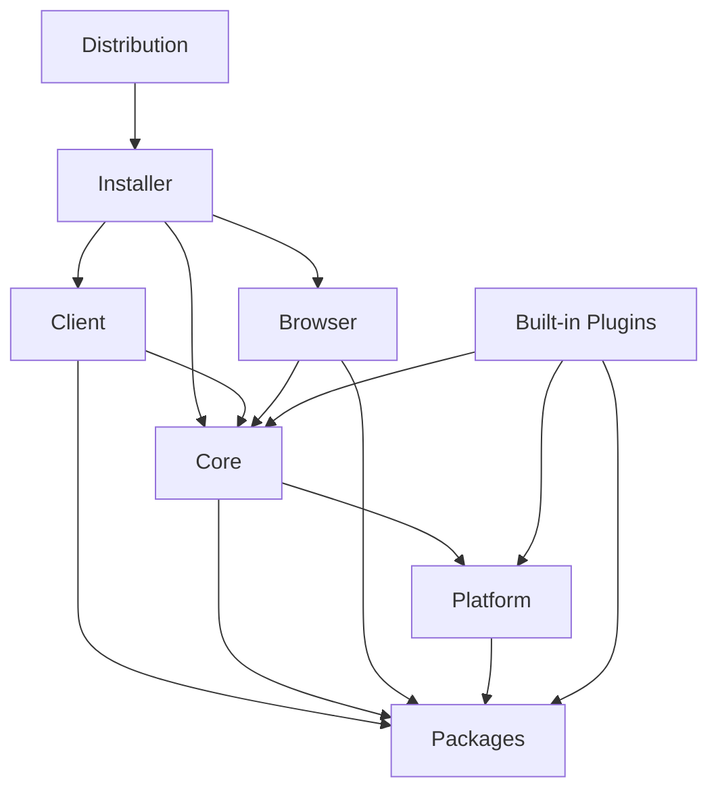

# Code Map

상태: `CURRENT`

이 문서는 사람이 읽는 공필 구성 지도다. 기계 판독 정본은 `component-registry.json`이며 두 파일은 함께 갱신한다.

## 현재 작업 위치

| 항목 | 값 |
|---|---|
| 작업 단위 | `bootstrap-foundation` |
| 브랜치 | `codex/bootstrap-structure` |
| 활성 컴포넌트 | `gongpil.architecture`, `gongpil.code-map-tooling` |
| 활성 기능 | `architecture.code-map.track`, `architecture.code-map.validate` |
| 목적 | 저장소 기초 구조와 상시 Code Map 추적 체계 구축 |

## 상태 라벨

| 상태 | 의미 |
|---|---|
| `CURRENT` | 파일과 검증 근거가 현재 존재함 |
| `TARGET` | 목표가 정해졌으나 구현되지 않음 |
| `TBD` | 구현 전 결정 필요 |

## 컴포넌트 관계



## 기능 위치

| 기능 | 소유 컴포넌트 | 현재 경로 | 상태 |
|---|---|---|---|
| 기능·작업 위치 추적 | Architecture | `docs/architecture/component-registry.json` | `CURRENT` |
| Code Map 검증 | Code Map Tooling | `scripts/validate-code-map.ps1` | `CURRENT` |
| 실행 기준 경로 결정 | Client | `client/` | `TARGET` |
| Core 프로세스 수명 관리 | Client | `client/` | `TARGET` |
| 문서 snapshot과 revision | Core | `core/` | `TARGET` |
| 변경 제안 승인과 적용 | Core | `core/` | `TARGET` |
| 공통 작업 UI | Browser | `browser/` | `TARGET` |
| 플러그인 격리 실행 | Platform | `platform/` | `TARGET` |
| Windows 설치 패키지 | Installer | `installer/` | `TARGET` |
| Markdown 편집기 | Built-in Plugins | `builtin-plugins/` | `TARGET` |

## Client와 Browser 경계

```text
Client
├─ appRoot
├─ dataRoot
├─ versionRoot
├─ sessionTemp
├─ bundledRuntimePath
└─ Core process lifecycle

Browser
├─ sessionId
├─ coreStatus
├─ activeProjectId
├─ activeProjectName
└─ readOnly
```

Browser는 Client의 실제 경로 값을 전달받지 않는다.

## 상시 갱신 순서

1. 작업 전 `workTracking`에 작업 단위, 브랜치, 활성 컴포넌트와 기능을 기록한다.
2. 새 기능은 구현 전에 `features`에 owner와 목표 경로를 등록한다.
3. 실제 코드가 생기면 status, path, entrypoints와 tests를 갱신한다.
4. 의존성이 바뀌면 `dependsOn`과 `usedBy`를 함께 갱신한다.
5. 이 문서의 현재 작업 위치와 기능 표를 registry에 맞춘다.
6. `scripts/validate-code-map.ps1`을 실행한다.
7. 최종 보고에 Code Map 갱신 여부와 검증 결과를 적는다.
